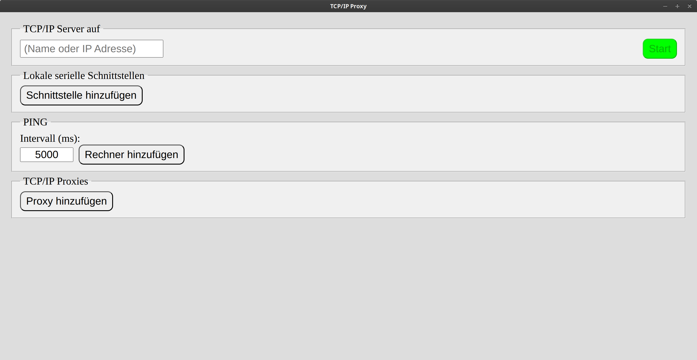
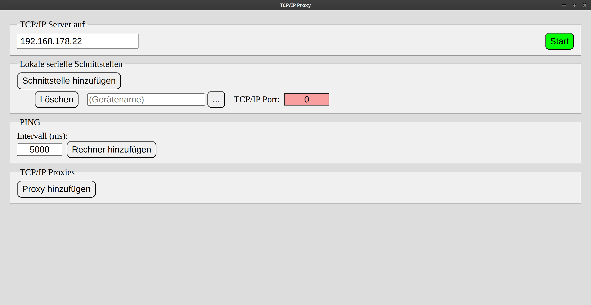
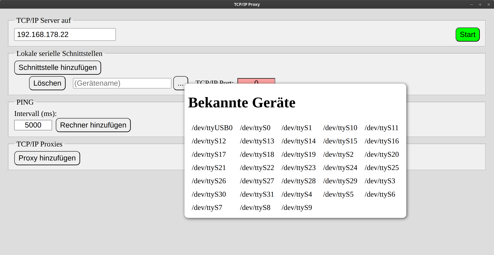
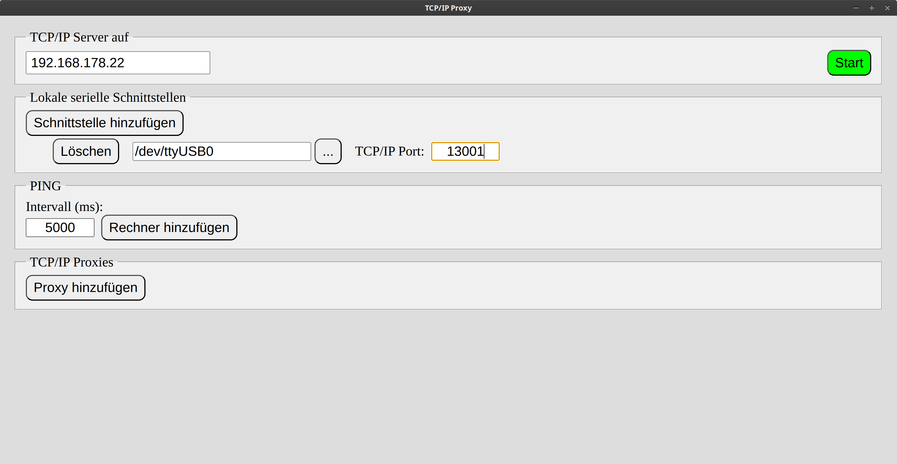
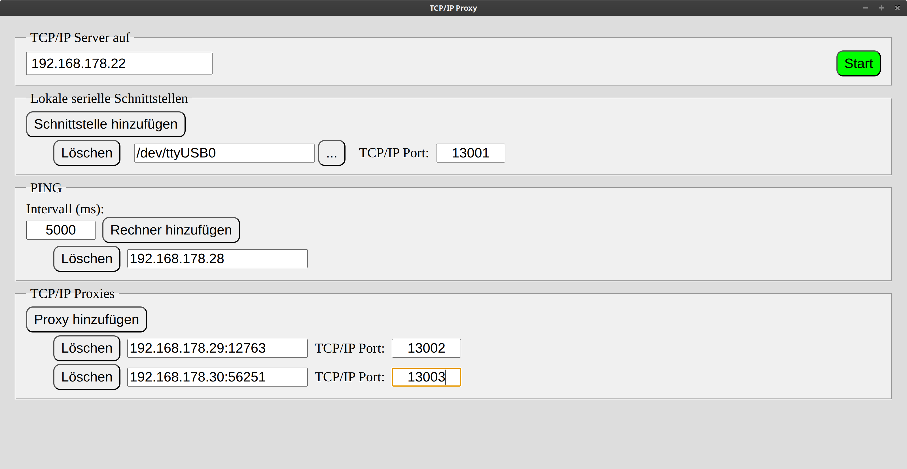
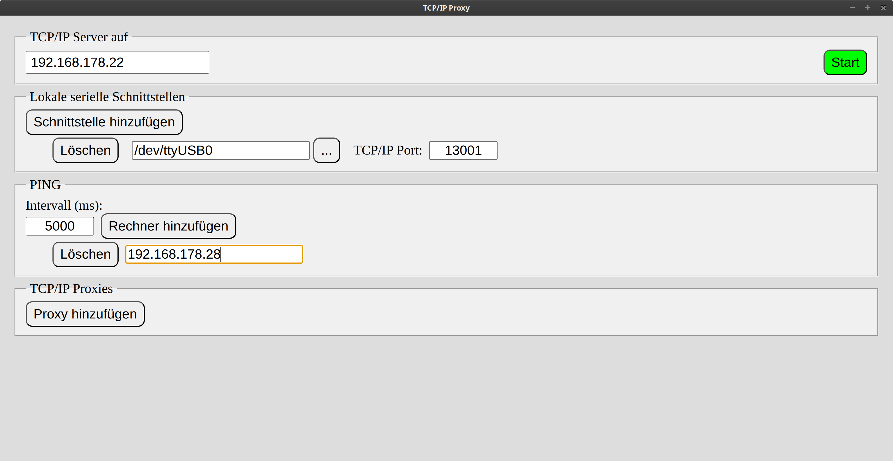
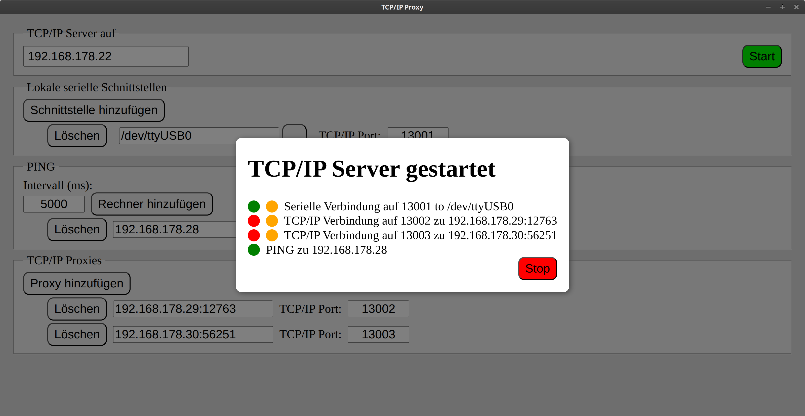
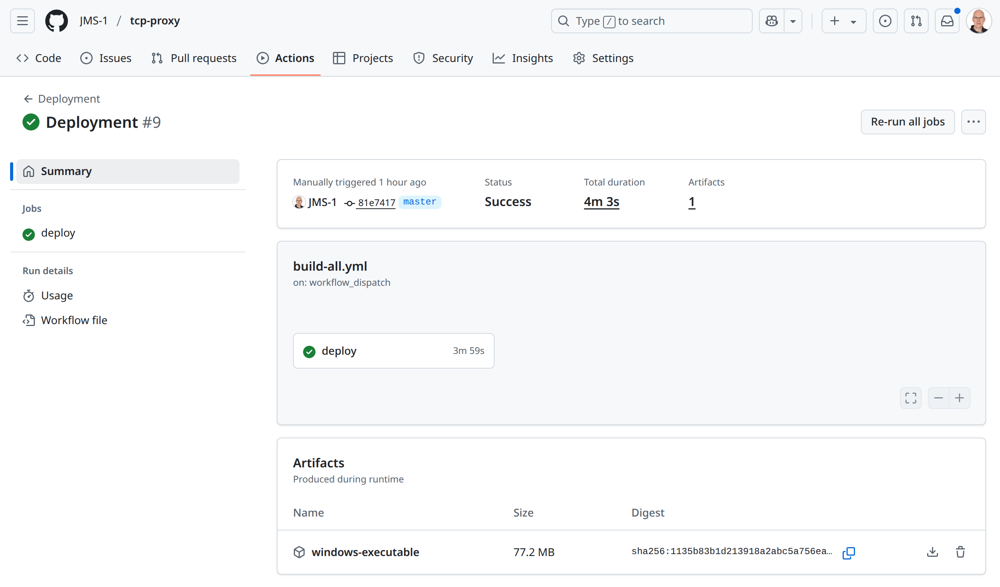

# TCP/IP Proxy

Dieses kleine Werkzeug auf Basis von [electron](https://www.electronjs.org/) entstand aus einer konkreten technischen Notwendigkeit. Ich könnte mir allerdings vorstellen, dass das hier umgesetzte Prinzip grundsätzlich interessant ist daher beschreibe ich das im Folgenden einmal sehr allgemein, ohne groß auf das konkrete Umfeld einzugehen.

Ausgangspunkt ist ein (Windows) Rechner, der exklusiv (i.e. ohne Zugriff von außen) einige Ressourcen verwaltet, die gerade für die Softwareentwicklung (aus Bequemlichkeit) aber auch für bestimmte Betriebsszenarien von anderen Systemen aus verfügbar sein sollten. Konkret handelt es sich hier um:

- serielle Anschlüsse (COMx)
- sekundäre Systeme, die über eine zweite Netzwerkkarte isoliert angeschlossen sind

Die Idee des Werkzeugs ist es, auf dem bezeichneten Rechner gestartet zu werden und dann bestimmte Geräte über TCP/IP Ports ansteuern zu können. Dabei wird aktuell grundsätzlich ein einfaches Durchreichen unterstützt, i.e. jedes eingehende TCP/IP Paket unverändert an das Gerät weitergeleitet und natürlich auch umgekehrt - im Falle der seriellen Leitung kann es durchaus sein, dass Pakete mit einzelnen Bytes übertragen werden, was aber nicht als Problem angesehen wird.

Eine Besonderheit des konkreten Szenarios ist, dass einige der sekundäre System erwarten, periodisch über ein PING (ICMP Protokoll) angesprochen werden und bei ausbleibenden Kontakten automatisch abschalten. Auch dies ist im Werkzeug umgesetzt.

# Konfiguration

Im obersten Feld wird die TCP/IP Adresse des Rechners selbst eingetragen. Zwar könnte das Werkzeug diese auch selbst ermitteln, allerdings hat der Rechner sicher mehr als eine Netzwerkkarte und dementsprechend auch mehrere Netzwerke. Damit die Anmeldung (LISTEN) der TCP/IP Ports auch eine externe Verfügbarkeit erreichen sollte hier immer die externe IP Adresse des Rechners explizit eingetragen werden.

Das Werkzeug unterstützt grundsätzlich das Durchreichen einer beliebigen Anzahl von seriellen Anschlüssen.

Über den `...` Schalter wird eine Auswahl aller bekannten Geräte geöffnet - hier in der Entwicklungsumgebung Linux, auf Windows erscheinen dann alle COMx Anschlüssen. Der Auswahldialog kann durch den Schalter auch wieder geschlossen werden und schließt sich automatisch wenn ein Anschluss ausgewählt wird. Eine manuelle Eingabe ohne den Dialog zu öffnen ist jederzeit möglich.

Die Auswahl eines TCP/IP Ports über den der Anschluss extern verfügbar gemacht werden soll schließt die Konfiguration eines seriellen Anschlusses ab. Empfohlene und erlaubte Werte liegen zwischen 1024 und 65535 - wie üblich.

Zusätzlich können Dienste von externen Diensten vor allem aus dem isolierten zweiten Netzwerk zum externen Zugriff freigeschaltet werden. Im Beispiel wird ein Entwicklungssystem mit nur einem einzigen Netzwerk verwendet.

Man beachte, dass natürlich für alle ausgewählten TCP/IP Ports (hier 13001 bis 13003) eine entsprechende Freischaltung in der Firewall des Rechners erfolgen muss, damit ein externen Zugriff möglich ist.

Abschließend können beliebige Rechner für ein periodisches PING eingerichtet werden - das Intervall zwischen ICMP Paketen ist einstellbar.

Mit der Schaltfläche `Start` werden alle TCP/IP Ports angemeldet (LIST) und die Verbindung zu den Geräten oder Endpunkten aufgebaut. Erst zu diesem Zeitpunkt werden zum Beispiel die seriellen Geräte vom Werkzeug geöffnet und damit üblicherweise exklusiv reserviert. Mit dem Beenden über `Stop` erfolgt dann eine zugehörige Freigabe.

Der Status der einzelnen Funktionalitäten wird wir folgt visualisiert:

- grün im ersten Punkt bedeutet, dass eine Verbindung zum lokalen Gerät respektive Endpunkt aufgebaut werden konnte, bei rot war das nicht möglich - im Beispiel wurde das serielle Gerät exklusiv geöffnet und das PING hat funktioniert, die sekundären Dienste sind allerdings nicht verfügbar
- grün im zweiten Punkten bedeutet, dass eine externe Verbindung zum Werkzeug aufgebaut wurde, gelb wie im Beispiel bedeutet, dass dies noch nicht erfolgt ist - bei PING gibt es den zweiten Punkt nicht

Ein Tooltip (`hover` mit der Maus) auf dem zweiten Punkt zeigt den bisher beobachten Datendurchsatz an.

# Entwicklung

Aktuell erfolgt die Entwicklung des Werkzeugs unter Linux, der Betrieb unter Windows, was einige kleine Probleme mit sich bringt. Hier erst einmal nur der rote Faden, eine Detaillierung erfolgt bei Bedarf.

Die lokale Entwicklung beginnt wie üblich mit einem `git clone` und dann einem `yarn` zur Installation der `node.js` Pakete - `yarn` muss separat installiert werden, e.g. `sudo dnf install yarn` unter Fedora 42.

Mit `yarn deploy` kann im `dist` Unterverzeichnis eine ausführbare Linux Datei (`appImage`) erstellt werden. Zum Entwickeln startet man die Visual Studio Code Task `watch`, mit der sowohl der electron Host als auch die Web Anwendung der Oberfläche des Werkzeugs im `watch` (`Hot Reload`) Modus gestartet werden - für den Host klappt das nicht so wirklich gut, hier ist ein expliziter Neustart je nach vorgenommener Änderung erforderlich. Eine Debug Sitzung beginnt man mit der `launch.json` Konfiguration `Debug`. Hier werden nun Breakpoints wohl in der Web Anwendung als auch im Host unterstützt.

Grundsätzlich ließe sich auch unter Linux unter Verwendung von [wine](https://www.winehq.org/) eine ausführbare Datei für Windows erstellen. In diesem konkreten Fall ist das allerdings nur mit hohem Aufwand und einigen Unbequemlichkeiten möglich. Ursprünglich war dies vorgesehen und zum Zugriff auf die seriellen Geräte wurde in der Web Anwendung die [Serial API](https://www.winehq.org/) verwendet. Bei der Erweiterung der ursprünglichen Version von einer seriellen Schnittstelle und einer Aktualisierung auf die neueste electron (und damit Chromium) Version zeigten sich einige Nachteile.

Daher verwendet das Werkzeug nun das `node.js` [serialport](https://www.npmjs.com/package/serialport) Paket, das mit einem nativen Anteil daherkommt. Das bedeutet, das je nach konkretem Betriebssystem und sogar electron Version dedizierte Binärdatei bereitgestellt werden.

Um diese zu vereinfachen wird im Repository ein GitHub Workflow `Deployment` angeboten, der in der `windows-latest` Umgebung eine ausführbare Datei für Windows als Artefakt erstellt. Da der Vorgang doch recht lange dauert (einige Minuten) ist dieser Ansatz mehr als berechtigt und vor allem auch ausreichend.

